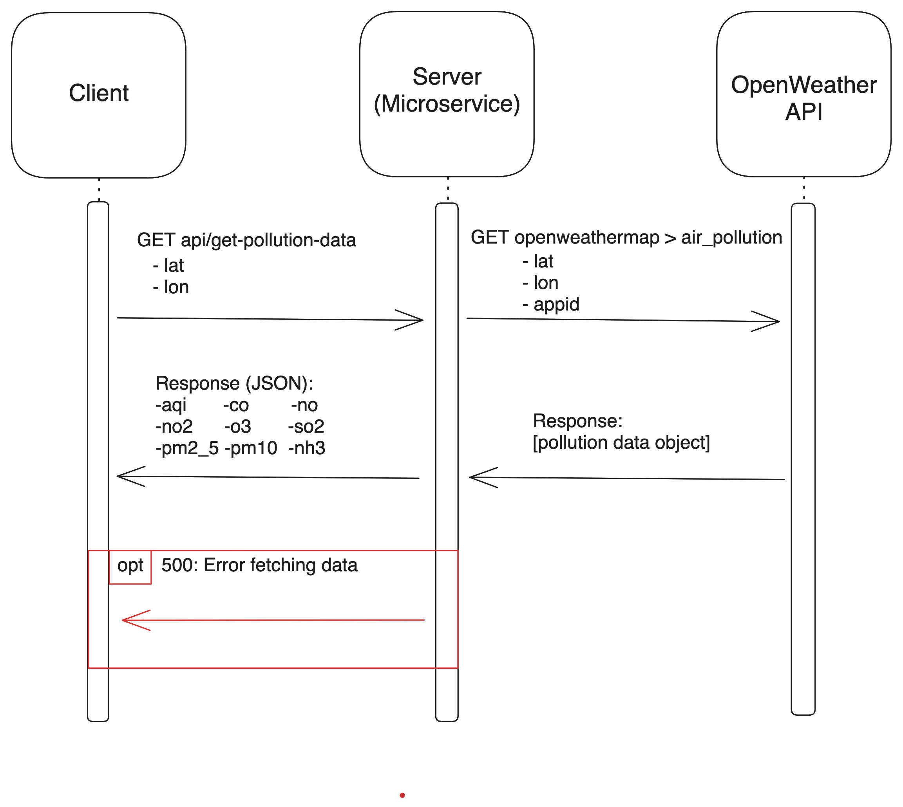

# Pollution Data Microservice

This microservice returns pollution data gathered from the [OpenWeatherMap API](https://openweathermap.org/api/air-pollution)
based on a given latitude and longitude.

NOTE: You must run `node install` before running the first time.

To start the service, just run:

```bash
node index.js
```

By default, it runns on port `5000`. A valid OpenWeatherMap API key must be
provided in index.js.

## Requesting Data

Requests can be made to the service via `GET` request. The endpoint is located at:

```url
.../api/get-pollution-data
```

The service takes two parameters:

`lat` - Latitude

`lon` - Longitude

Example:

```javascript
curl "localhost:8080/weather_microservice?lat=37.7749&lon=122.4194"
```

A live demo of the service is available at:

<https://361-microservice.vercel.app/api/get-pollution-data>

## Receiving data

Requests to the above endpoint will receive a response in JSON containing the
AQI for the specified location, along with measurements of of common pollutants.

Example:

```json
{
  "aqi": 3,
  "co": 720.98,
  "no": 34.87,
  "no2": 55.52,
  "o3": 0.01,
  "so2": 4.95,
  "pm2_5": 31.7,
  "pm10": 39.97,
  "nh3": 2.31
}
```

## UML Diagram


